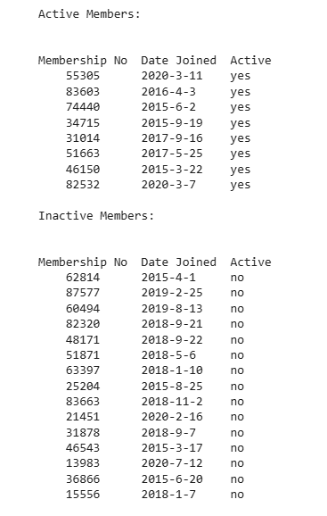

# member-data-cleanup
Python script for cleaning and organizing membership data by separating active and inactive users.
# Member Data Cleanup (Python)

This project demonstrates a simple data-cleaning workflow using Python file handling.

## Overview
A membership file is processed to:
- Identify inactive members marked as "no"
- Remove them from the current member list
- Append them to a separate inactive member file
- Preserve the original file structure and formatting

## Features
- File reading and writing (`r+`, `a+`)
- Conditional filtering of records
- Data separation into multiple files
- Header preservation

## Technologies
- Python (file handling, loops, conditionals)

## Files
- `member_data_cleanup.ipynb` (or `.py`)
- `members.txt`
- `inactive.txt`

## Example Output
- Active members file contains only "yes"
- Inactive members are moved to a separate file

## Why this project
This was created as part of learning Python for data analytics, focusing on real-world data cleaning and preprocessing tasks.
## Output Preview

The script separates active and inactive members while preserving the original file structure.
